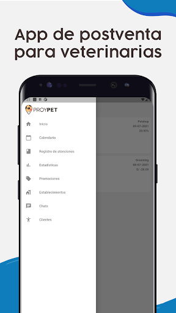
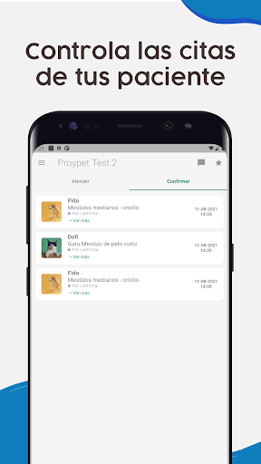
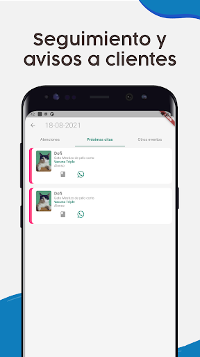
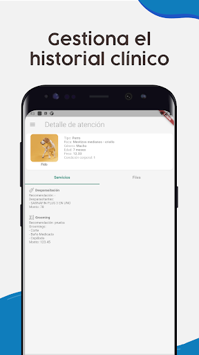
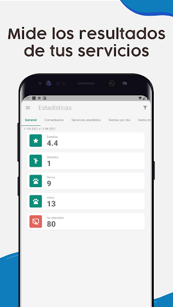

# 🐾 Proypet – App de Gestión Veterinaria

**Proypet** es una aplicación móvil desarrollada con Flutter, pensada para veterinarios y groomers. Facilita el seguimiento de clientes, la gestión de servicios postventa, el historial clínico de los pacientes, y permite programar notificaciones para futuras citas y seguimientos.

---

## 🚀 Características Principales

- 📋 Registro y gestión de clientes y sus mascotas.
- 🗓️ Programación de citas y recordatorios automáticos.
- 🧾 Almacenamiento del historial clínico de cada paciente.
- 🔔 Notificaciones push para próximas citas y seguimientos.
- 📊 Panel de control para visualizar estadísticas y métricas relevantes.

---

## 🛠️ Tecnologías Utilizadas

- **Flutter** – Framework multiplataforma.
- **Supabase** – Backend completo:
  - Autenticación.
  - PostgreSQL Database.
  - Storage.
- **Firebase Cloud Messaging (FCM)** – Notificaciones push.
- **Provider** – Gestión de estados en Flutter.

---

## 📦 Instalación y Configuración

1. Clona el repositorio:

   ```bash
   git clone https://github.com/joalmr/veterinary-app-flutter-fcm-supabase.git
   cd veterinary-app-flutter-fcm-supabase
   ```

2. Instala las dependencias:

   ```bash
   flutter pub get
   ```

3. Crea un archivo .env en la raíz del proyecto y completa tus claves:

   ```bash
   SUPABASE_URL=...
   SUPABASE_ANON_KEY=...
   FCM_API_KEY=...
   ```

4. Corre la aplicación:

   ```bash
   flutter run
   ```

---

## 🧠 Aprendizajes y Desafíos
Durante el desarrollo de este proyecto aprendí a:
- Usar Supabase como alternativa a Firebase para auth, base de datos y storage.
- Integrar Firebase Cloud Messaging en Flutter.
- Diseñar una arquitectura escalable utilizando Provider como gestor de estado.
- Separar datos clínicos por paciente y controlarlos desde una UI amigable.

---

## 🔮 Próximas Funcionalidades
- 📍 Integración con mapas para localizar veterinarias cercanas.
- 🧑‍⚕️ Perfil profesional para veterinarios y groomers.
- 💬 Chat en tiempo real entre clientes y profesionales.

---

## 🤝 Contribuciones
¡Toda contribución es bienvenida!
Pasos para colaborar:
   ```bash
   1. Fork del repositorio.
   2. Crea una rama: git checkout -b feature/nueva-funcionalidad
   3. Haz tus cambios: git commit -am 'Agrega nueva funcionalidad'
   4. Haz push: git push origin feature/nueva-funcionalidad
   5. Abre un Pull Request.
   ```

---

## 📄 Licencia
Este proyecto está bajo la licencia [MIT](#).

---

## 📬 Contacto
Puedes contactarme desde mi portafolio:
👉 [https://joalmr.vercel.app](https://joalmr.vercel.app)

---

## Partners Proypet






